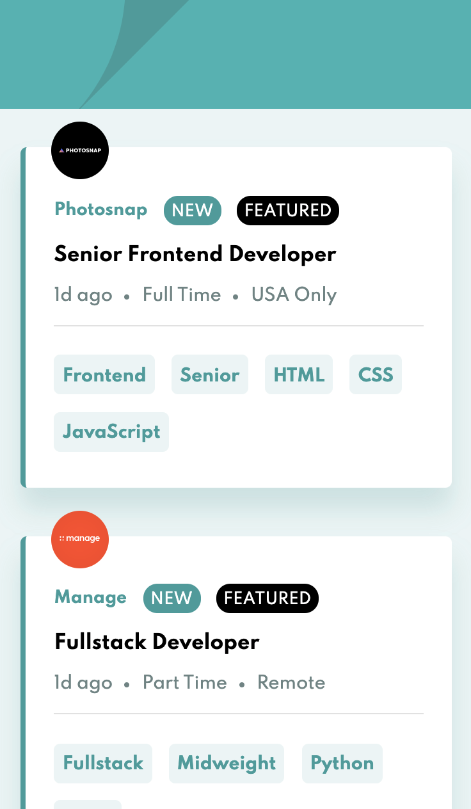
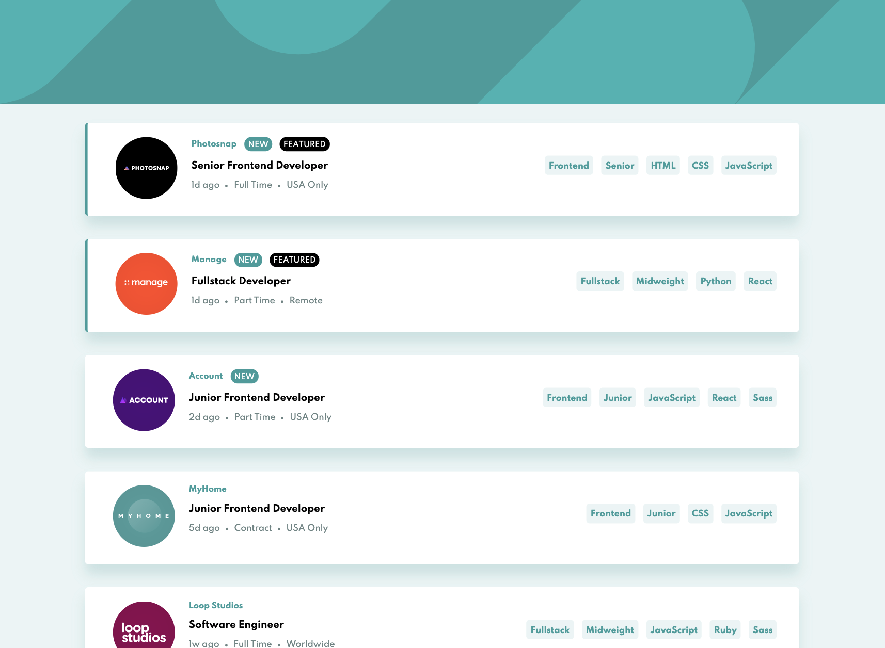

# Frontend Mentor - Job listings with filtering solution

## Welcome! 👋

This is a solution to the [Job listings with filtering challenge on Frontend Mentor](https://www.frontendmentor.io/challenges/job-listings-with-filtering-ivstIPCt). 

## Table of contents

- [Overview](#overview)
  - [The challenge](#the-challenge)
  - [Screenshot](#screenshot)
  - [Links](#links)
- [My process](#my-process)
  - [Built with](#built-with)
  - [What I learned](#what-i-learned)
- [Author](#author)

## Overview

### The challenge

Users should be able to:

- View the optimal layout for the site depending on their device's screen size
- See hover states for all interactive elements on the page
- Filter job listings based on the categories

### Screenshot

| Mobile (375px)                                 | Desktop (1440px)                                 |
| ---------------------------------------------- | ------------------------------------------------ |
|  |  |

### Links

- Solution URL: [Code](https://github.com/amallen1/job-listings)
- Live Site URL: [Job Listings](https://gallant-dubinsky-8bfaba.netlify.app/)

## My process

### Built with

- HTML
- Scss
- Mobile-first workflow
- [React](https://reactjs.org/) - JS library

### What I learned

I used previous knowledge gained from past projects to implement this solution.

## Author

- Frontend Mentor - [@amallen1](https://www.frontendmentor.io/profile/amallen1)
